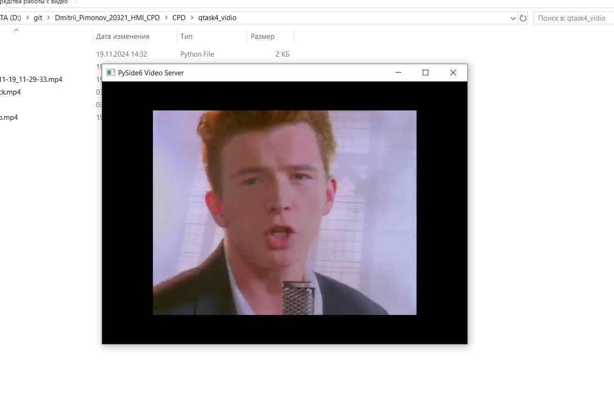

# Dremwar_HMI
Задание: Task_4 Клиент отправляет видео на PySide6 сервер, где проиходит отображение этого видео в виджете.

# Описание программы 4:
В этих двух программах сервира и клиента я реализовал отправку видео на сервер PySide6 и его воспроизведения.

# Листинг 4:
Сервер(server_mp4.py)
```Py
import sys #импортируем библиотеки
from PySide6.QtCore import QByteArray, QUrl, QFile, QIODevice
from PySide6.QtMultimedia import QMediaPlayer
from PySide6.QtMultimediaWidgets import QVideoWidget
from PySide6.QtNetwork import QTcpServer, QTcpSocket
from PySide6.QtWidgets import QApplication, QMainWindow
import video_pb2
import struct
class VideoServer(QMainWindow):
    def __init__(self):
        super().__init__()
        self.setWindowTitle("Streaming Video Server") #Название главного окнаы
        self.video_widget = QVideoWidget() # Настройка виджета для видео
        self.setCentralWidget(self.video_widget)#Центральный виджет, виджет отображения

        self.media_player = QMediaPlayer()# Настройка QMediaPlayer
        self.media_player.setVideoOutput(self.video_widget)#метод воспроизведения видио

        self.temp_file = QFile("streamed_video.mp4")# Временный файл для записи видео
        self.temp_file.open(QIODevice.WriteOnly)  # Открываем файл на запись

        self.tcp_server = QTcpServer(self)# Настройка TCP-сервера на порту 12345
        self.tcp_server.listen(port=12345)
        self.tcp_server.newConnection.connect(self.handle_new_connection)#Обработка новых подключений

        print("Сервер запущен на порту 12345")

    def handle_new_connection(self): #функция нового подключения
        self.client_socket = self.tcp_server.nextPendingConnection()#метод обрабатывающий подключение
        self.client_socket.readyRead.connect(self.read_data)#Метод читающий данные от клиента
        self.client_socket.disconnected.connect(self.client_socket.deleteLater)#метод обрабатывающий отключение клиента
        print("Клиент подключен")
        self.media_player.setSource(QUrl.fromLocalFile("streamed_video.mp4"))# Устанавливаем источник для воспроизведения
        self.media_player.play()  # Начинаем воспроизведение

    def read_data(self):#Чтение данных от клиента
        while self.client_socket.bytesAvailable():
            if self.client_socket.bytesAvailable() < 4:# Если нет длины сообщения, ждем
                return
            length_data = self.client_socket.read(4)#Читаем длину сообщения
            message_length = struct.unpack(">I", bytes(length_data))[0]  # Преобразуем QByteArray в bytes
            if self.client_socket.bytesAvailable() < message_length:#Ждём доставки
                return
            message_data = self.client_socket.read(message_length)# Читаем сообщение
            video_message = video_pb2.VideoData()# Преобразование сообщения Protobuf
            video_message.ParseFromString(bytes(message_data))  # Преобразуем QByteArray в bytes
            self.process_video_chunk(video_message)# Обработка полученного чанка

    def process_video_chunk(self, video_message):#Обработка одного видео-чанка
        if video_message.is_end:
            print("Передача завершена")
            self.media_player.stop()

if __name__ == "__main__":
    app = QApplication(sys.argv)
    server = VideoServer()
    server.show()
    sys.exit(app.exec())

```
Клиент(client_mp4.py)
```Py
import sys# Импортируем библиотеки
import video_pb2
from PySide6.QtCore import QFile
from PySide6.QtNetwork import QTcpSocket
from PySide6.QtWidgets import QApplication
import struct

class VideoClient:
    def __init__(self, server_ip='127.0.0.1', server_port=12345):
        self.server_ip = server_ip
        self.server_port = server_port
        self.client_socket = QTcpSocket()
        self.client_socket.connected.connect(self.on_connected)
        self.client_socket.connectToHost(self.server_ip, self.server_port)

    def on_connected(self):#Функция подключение клиента к серверу
        print(f"Подключено к серверу {self.server_ip}:{self.server_port}")
        self.send_video('D:\git\Dmitrii_Pimonov_20321_HMI_CPD\CPD\qtask4_vidio\qvideoplayback.mp4')  # Отправляем видео, как только подключились


    def send_video(self, filename):#Функция отправки видио
        with open(filename, 'rb') as f:
            video_data = f.read()

        chunk_size = 1024  # Размер чанка
        total_size = len(video_data)
        print(f"Начинаю отправку видео, размер файла: {total_size} байт")

        for i in range(0, total_size, chunk_size):#цыкл разбития файла на чанки.
            chunk = video_data[i:i + chunk_size]
            video_message = video_pb2.VideoData()# Создание сообщения Protobuf
            video_message.video_chunk = chunk
            video_message.is_end = (i + chunk_size >= total_size)  # Устанавливаем флаг окончания

            serialized_message = video_message.SerializeToString()#Создаёт сообщение для отправки данных
            message_length = len(serialized_message)#Определяем длину сообщения

            # Отправляем длину сообщения
            self.client_socket.write(struct.pack(">I", message_length))
            self.client_socket.write(serialized_message)#Отправляет сообщение
            self.client_socket.flush()#очищаем буфер

        print("Видео отправлено")

if __name__ == "__main__":
    app = QApplication(sys.argv)
    client = VideoClient()
    app.exec()  # Запуск приложения PySide6
```


