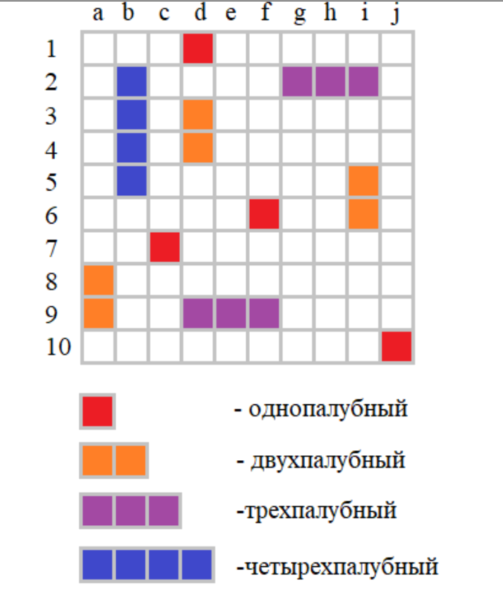
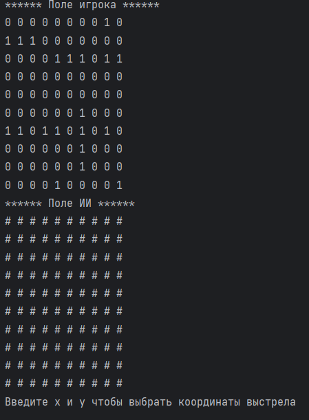
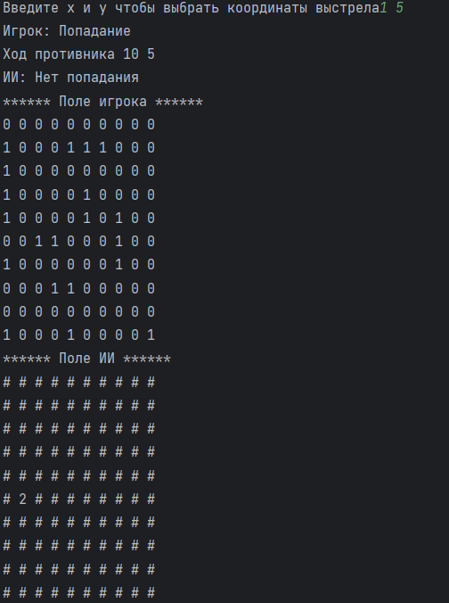

# Dremwar_HMI
Задание:
Руководство компании целыми днями не знает куда себя деть. Поэтому они решили дать задание своим программистам написать программу игры "Морской бой". Но эта игра будет немного отличаться от классической. Для тех, кто не знаком с этой древней, как мир, игрой, напомню ее краткое описание.

Каждый игрок у себя на бумаге рисует игровое поле 10 х 10 клеток и расставляет на нем десять кораблей: однопалубных - 4; двухпалубных - 3; трехпалубных - 2; четырехпалубный - 1.



Корабли расставляются случайным образом, но так, чтобы не выходили за пределы игрового поля и не соприкасались друг с другом (в том числе и по диагонали).

Затем, игроки по очереди называют клетки, куда производят выстрелы. И отмечают эти выстрелы на другом таком же поле в 10 х 10 клеток, которое представляет поле соперника. Соперник при этом должен честно отвечать: "промах", если ни один корабль не был задет и "попал", если произошло попадание. Выигрывает тот игрок, который первым поразит все корабли соперника.

Но это была игра из глубокого прошлого. Теперь же, в компьютерную эру, корабли на игровом поле могут перемещаться в направлении своей ориентации на одну клетку после каждого хода соперника, если в них не было ни одного попадания.

Итак, лично вам поручается сделать важный фрагмент этой игры - расстановку и управление кораблями в этой игре. А само задание звучит так.


# Описание программы:
В данной программе на языке Python я реализовал три класса:
-Ship:
    *Конструктор (__init__): задает основные параметры корабля, такие как его длина, направление (горизонтальное или вертикальное), начальные координаты и состояние ячеек (1 — здоровая ячейка, 2 — повреждённая).
    *set_start_coords: устанавливает начальные координаты корабля на поле.
    *get_start_coords: возвращает координаты, где корабль находится.
    *move: передвигает корабль по горизонтали или вертикали на определенное количество клеток.
    *is_collide: проверяет, сталкивается ли корабль с другим кораблем.
    *is_out_pole: проверяет, выходит ли корабль за пределы поля.
    *get_z и get_self_zone: вычисляют зоны вокруг корабля и саму зону, занимаемую кораблем, для проверки столкновений и размещения на поле.
    *make_position: создает позиции корабля, которые занимают ячейки на игровом поле.
    *__getitem__ и __setitem__: позволяют обращаться к состоянию ячеек корабля как к элементам списка.

-GamePole:
    *Конструктор (__init__): создает поле заданного размера и инициализирует корабли.
    *init: расставляет корабли случайным образом на поле, проверяя, чтобы они не выходили за границы и не сталкивались друг с другом.
    *update_pole: обновляет текущее состояние поля, заполняя его позициями кораблей.
    *show и secret_show: выводят поле на экран. show показывает расположение всех кораблей, а secret_show скрывает информацию о неповреждённых кораблях, отображая их как #.
    *move_ships: передвигает корабли по полю случайным образом, проверяя возможность перемещения с помощью функции move_check

-GameService:
    *Конструктор (__init__): создаёт два объекта класса GamePole — для игрока и для ИИ.
    *player_attack: выполняет атаку игрока на поле ИИ. Если координаты попадают в корабль, его состояние меняется на повреждённое (2).
    *ii_attack: выполняет атаку ИИ на поле игрока.
    *run: основной цикл игры. Игрок вводит координаты атаки, затем ИИ делает свой ход. После каждого хода корабли на поле могут двигаться.

Основная логика:
Корабли создаются случайным образом с разными длинами (один корабль длиной 4 клетки, несколько кораблей длиной 3, 2 и 1 клетку). Игровое поле обновляется после каждой атаки или перемещения кораблей. Атака игрока и ИИ: игрок вводит координаты атаки, ИИ выбирает их случайно. Перемещение кораблей: после каждой атаки корабли могут случайным образом перемещаться по полю. Отображение поля: игровое поле выводится как для игрока, так и для ИИ, где поле ИИ скрыто.
# Листинг:

```Py
from random import randint, choice #Импортируем библиотеки

class Ship: #Класс описывает поведение отдельного корабля
    def __init__(self, length: int, tp=1, x=None, y=None) -> None:
        self._length = length  # Длина корабля
        self._tp = tp  # Направление: 1 - горизонтально, 2 - вертикально
        self._x = x  # Начальные координаты по x
        self._y = y  # Начальные координаты по y
        self._is_move = True  # Может ли корабль двигаться
        self._cells = [1] * length  # Состояние ячеек корабля: 1 - здоров, 2 - повреждён

    def set_start_coords(self, x: int, y: int): #Начальные кординаты корабля
        self._x = x
        self._y = y

    def get_start_coords(self) -> tuple: #Текущие положение корабля
        return self._x, self._y

    def move(self, go: int):#Движение корабля по полю: go - на сколько клеток сдвигаться
        if self._is_move:
            if self._tp == 1:
                self._x += go  # Горизонтальное перемещение
            elif self._tp == 2:
                self._y += go  # Вертикальное перемещение

    def is_collide(self, ship):#Проверка столкновений с другим кораблём
        if self._x is None or self._y is None or ship._x is None or ship._y is None:
            return False  # Если координаты не заданы, столкновения быть не может

        # Зоны обоих кораблей
        ship_zone = self.get_z(ship._x, ship._y, ship._tp, ship._length, 10)
        self_zone = self.get_self_zone(self._x, self._y, self._tp, self._length)

        for coord in self_zone: #Сравнивает зоны кораблей и проверяет их на пересечения
            if coord in ship_zone:
                return True
        return False

    def is_out_pole(self, size: int) -> bool: #Проверка, выходит ли корабль за пределы игрового поля
        if self._tp == 1:
            return (self._x + self._length) > size
        else:
            return (self._y + self._length) > size

    def get_z(self, x: int, y: int, tp: int, length: int, size: int) -> list:#Зона вокруг корабля для проверки столкновений
        zone = []
        if tp == 1:# Горизонтальный корабль
            zone = [[i, j] for i in range(x - 1, x + length + 1) if 0 <= i < size for j in range(y - 1, y + 2) if 0 <= j < size]
        elif tp == 2:# Вертикальный корабль
            zone = [[i, j] for i in range(x - 1, x + 2) if 0 <= i < size for j in range(y - 1, y + length + 1) if 0 <= j < size]
        return zone

    def get_self_zone(self, x: int, y: int, tp=None, length=None) -> list: #Зона, занимаемая самим кораблем
        if tp == 1:# Горизонтальный корабль
            return [[i, y] for i in range(x, x + length)]
        else:# Вертикальный корабль
            return [[x, i] for i in range(y, y + length)]

    def make_position(self) -> dict:#Создание позиции корабля на поле
        position = {}
        if self._tp == 1:# Горизонтальный корабль
            for i in range(self._length):
                position[i] = (self._x + i, self._y, self._cells[i])
        else:# Вертикальный корабль
            for i in range(self._length):
                position[i] = (self._x, self._y + i, self._cells[i])
        return position

    @property
    def tp(self):
        return self._tp

    @property
    def length(self):
        return self._length

    def __getitem__(self, item):
        return self._cells[item]

    def __setitem__(self, item, value):
        self._cells[item] = value
class GamePole:
    def __init__(self, pole_size: int) -> None: #Функция входных данных
        self._size = pole_size # Размер поля.
        self._ships = [] # Все корабли.
        self._spaced_ships = [] #Размещённые корабли
        self._pole = [[0 for i in range(self._size)] for i in range(self._size)] # Игровое поле.

    def init(self): #Расстановка кораблей и проверка коллизии
        self._ships = [Ship(4, tp=randint(1, 2)), Ship(3, tp=randint(1, 2)), Ship(3, tp=randint(1, 2)),
                       Ship(2, tp=randint(1, 2)), Ship(2, tp=randint(1, 2)), Ship(2, tp=randint(1, 2)),
                       Ship(1, tp=randint(1, 2)), Ship(1, tp=randint(1, 2)), Ship(1, tp=randint(1, 2)),
                       Ship(1, tp=randint(1, 2))]
        starting_ships = self._ships[0] # Установка первого корабля
        while True:
            x = randint(0, self._size - 1)
            y = randint(0, self._size - 1)
            starting_ships.set_start_coords(x, y)
            if not starting_ships.is_out_pole(self._size):
                self._spaced_ships.append(starting_ships)
                break

        for i in range(1, len(self._ships)): # Установка остальных кораблей
            ship = self._ships[i]
            while True:
                sz = self._size - 1
                x = randint(0, sz)
                y = randint(0, sz)
                ship.set_start_coords(x, y)
                count = 0
                for spaced_ship in self._spaced_ships:
                    if not ship.is_collide(spaced_ship):
                        count += 1
                if (not ship.is_out_pole(self._size)) and (count == len(self._spaced_ships)):
                    self._spaced_ships.append(ship)
                    break
        self.make_pole()

    def get_ships(self):
        return self._ships

    def update_pole(self): # Функция обновления поля
        self._pole = [[0 for _ in range(self._size)] for _ in range(self._size)]
        for ship in self._ships:
            x, y = self.get_random_cords(ship) if ship._x == ship._y is None else ship.get_start_coords()
            if ship.tp == 1:
                for index, i in enumerate(range(x, x + ship.length)):
                    self._pole[y][i] = ship._cells[index]
            elif ship.tp == 2:
                for index, i in enumerate(range(y, y + ship.length)):
                    self._pole[i][x] = ship._cells[index]
            ship.set_start_coords(x, y)

    def show(self):
        self.update_pole()#Обновление поля
        for row in self._pole:
            print(" ".join([str(v) for v in row])) #Вывод поля в консоль

    def secret_show(self):#Обнавляет поле в скрытом формате, чтобы игрок его не видел
        self.update_pole()
        for row in self._pole:
            for v in row:
                if v != 2:
                    print("#", end=" ")
                else:
                    print(str(v), end=" ")
            print("\n", end="")

    def get_pole(self):#Возвращение поля в форме кортежа
        return tuple(tuple(i) for i in self._pole)

    def make_pole(self):#Обновление позиций кораблей на поле
        for ship in self._ships:
            for index, data in ship.make_position().items():
                self._pole[data[0]][data[1]] = data[2]

    def move_check(self, ship, go): # Проверка возможности движения корабля
        x, y = ship.get_start_coords() #Получаем кординаты кораблей
        if ship.tp == 1: #Проверка движения корабля по горизонтали
            zone = ship.get_z(x + go, y, ship.tp, ship.length, self._size)
            if go == 1: #начинаем движение кораблей
                check_length = x + go + ship.length
            else:
                check_length = x + go - 1
            for x_z, y_z in zone: #проверяем каждую клетку вокруг корабля
                if self._pole[y_z][x_z] != 0 and x_z == check_length:
                    return False

            if x + go < 0 or x + go + ship.length > self._size: #проверяем не выходит ли корабль за пределы поля
                return False

        elif ship.tp == 2: #Проверка движения корабля по вертикале
            zone = ship.get_z(x, y + go, ship.tp, ship.length, self._size)
            if go == 1:
                check_lenght = y + go + ship.length
            else:
                check_lenght = y + go - 1
            for x_z, y_z in zone:
                if self._pole[y_z][x_z] != 0 and y_z == check_lenght:
                    return False

            if y + go < 0 or y + go + ship.length > self._size:
                return False
        return True

    def move_ships(self) -> None: # Движение кораблей
        for ship in self._ships:
            go = choice([-1, 1]) # Случайное направление: -1 (влево/вверх) или 1 (вправо/вниз)
            flag = self.move_check(ship, go) # Проверяем на препятствие
            if flag:
                ship.move(go)
                self.update_pole()
            else:
                flag = self.move_check(ship, -go)
                if flag:
                    ship.move(-go)
                    self.update_pole()
        self._attacked = []


class GameService:
    def __init__(self, size) -> None:
        self.player_pole = GamePole(size)
        self.ii_pole = GamePole(size)

    def player_attack(self, x, y): # Атака игрока
        for ship in self.ii_pole.get_ships():
            if [x, y] in ship.get_self_zone(ship._x, ship._y, ship._tp, ship._length):
                if ship._tp == 1:#проверка поподаня по горизонтали
                    ship._cells[x - ship._x] = 2
                    print("Игрок: Попадание")
                    break
                if ship._tp == 2:#проверка поподаня по вертикали
                    ship._cells[y - ship._y] = 2
                    print("Игрок: Попадание")
                    break
        else:
            print("Игрок: Нет попадания")

    def ii_attack(self): # Атака ИИ по рандомным кординатам
        x = randint(0, self.player_pole._size)
        y = randint(0, self.player_pole._size)
        print("Ход противника",x,y)
        for ship in self.player_pole.get_ships():
            if [x, y] in ship.get_self_zone(ship._x, ship._y, ship._tp, ship._length):
                if ship._tp == 1:#проверка поподаня по горизонтали
                    ship._cells[x - ship._x] = 2
                    print("ИИ: Попадание")
                    break
                if ship._tp == 2:#проверка поподаня по вертикали
                    ship._cells[y - ship._y] = 2
                    print("ИИ: Попадание")
                    break
        else:
            print("ИИ: Нет попадания")

    def run(self): # Запуск игры
        self.player_pole.init()
        self.ii_pole.init()
        while True:
            print("Поле игрока:")
            self.player_pole.show()
            print("Поле ИИ:")
            self.ii_pole.secret_show()
            x, y = input("Введите х и у чтобы выбрать координаты выстрела").split(' ')
            self.player_attack(int(x), int(y))
            self.ii_attack()
            self.player_pole.move_ships()
            self.ii_pole.move_ships()

if __name__ == "__main__":
    game = GameService(10)
    game.run()
```

Скриншот1(Начало программы):



Скриншот2(Результат программы при попадании):




