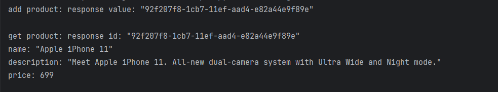

# Dremwar_HMI
Задание: Дописать программу с GitHub с добафлением функции.
"Глава 1,2
Разобрать пример Python с GitHub.

В github пример Python. С добавленным сервисом и полями, которые используются."

# Описание программы:
В данных двух программах на языке Python Реализуется gRPC Сервер и клиент которые могут обмениваться данными. В их функции входит Создание, добавление и удаление опряделённого продукта заданного пользователем. 

# Листинг:
Сервер
```Py
#Импортируем необходимые библиотеки: futures, uuid, grpc и time.
from concurrent import futures
import uuid
import grpc
import time

#Загрузка сгенерированныъ файлов
import product_info_pb2
import product_info_pb2_grpc

#Создаём класс, который будет содержать методы для добавления, получения и удаления продуктов
class ProductInfoServicer(product_info_pb2_grpc.ProductInfoServicer):
    def __init__(self):
        self.productMap = {}

    #В методе addProduct мы создаем уникальный идентификатор для продукта, сохраняем его в словаре productMap и возвращаем идентификатор
    def addProduct(self, request, context):
        id = uuid.uuid1()
        request.id = str(id)
        print("addProduct:request", request)
        self.productMap[str(id)] = request
        response = product_info_pb2.ProductID(value = str(id))

        print("addProduct:response", response)
        return response

    #В методе getProduct получаем идентификатор продукта и возвращаем соответствующую информацию о продукте
    def getProduct(self, request, context):
        print("getProduct:request", request)
        id = request.value
        response = self.productMap[str(id)]
        print("getProduct:response", response)
        return response
    
    #В методе deleteProduct удаляем продукт из словаря productMap
    def deleteProduct(self, request, context):
        print("deleteProduct:request", request)
        id = request.value
        if str(id) in self.productMap:
            del self.productMap[str(id)]
            response = product_info_pb2.Empty()
            print("deleteProduct:response", response)
            return response
        else:
            context.set_code(grpc.StatusCode.NOT_FOUND)
            context.set_details("Product not found")
            return product_info_pb2.Empty()

#Создаём GRPC сервер
server = grpc.server(futures.ThreadPoolExecutor(max_workers=10))

#используйте сгенерированную функцию `add_ProductInfoServicer_to_server` чтобы добавить определенный класс на сервер
product_info_pb2_grpc.add_ProductInfoServicer_to_server(ProductInfoServicer(), server)

# Открываем порт 50051
print('Starting server. Listening on port 50051.')
server.add_insecure_port('[::]:50051')
server.start()

#поскольку server.start() не будет блокироваться, добавим  цикл для поддержания его активности

try:
    while True:
        time.sleep(86400)
except KeyboardInterrupt:
    server.stop(0)
```

Клиент
```Py
#Импортируем библиотеки
import grpc

#Загрузка сгенерированныъ файлов
import product_info_pb2
import product_info_pb2_grpc

#Функция отправки сообщений от клиента
def run():
    # Откроем gRPC канал
    channel = grpc.insecure_channel('localhost:50051')
    # Создание Клиента
    stub = product_info_pb2_grpc.ProductInfoStub(channel)

    #Название и описание продукта
    response = stub.addProduct(product_info_pb2.Product(name = "Apple iPhone 11", description = "Meet Apple iPhone 11. All-new dual-camera system with Ultra Wide and Night mode.", price = 699.0 ))
    print("add product: response", response)
    productInfo = stub.getProduct(product_info_pb2.ProductID(value = response.value))
    print("get product: response", productInfo)
    dell=stub.add_ProductInfoServicer_to_server(ProductInfoServicer(), server)
    print("delete product: response",dell)

run()
```
Скриншот1(Результат работы п):




