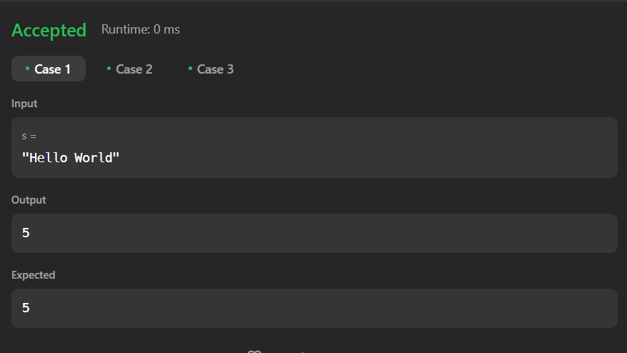

# Dremwar_CPD
Задание: Length of Last Word (Если задана строка s, состоящая из слов и пробелов, верните длину последнего слова в строке.)


# Описание программы Length of Last Word:
Данная прога принимает строку и выводит длину последнего слова в этой строке.


# Листинг Length of Last Word:
```rs
Программа в leetcode
impl Solution {
    pub fn length_of_last_word(s: String) -> i32 {
        let last_word_length = match s.split_whitespace().last() {
        Some(last_word) => last_word.len(),
        None => 0,
        };
        return(last_word_length as i32) 
    }
}
```

```rs
программа в visual studio
use std::io;
fn main() {
    let mut guess = String::new();
    io::stdin()
        .read_line(&mut guess);

    let length = guess.len();
    
    let a = guess.split(" ");
    
    let mut length2=0;
    for part in a {
    length2 = part.len();
    }
    println!("{:#?}",length2-2); 
}
```

Скриншот1(Результат работы):




