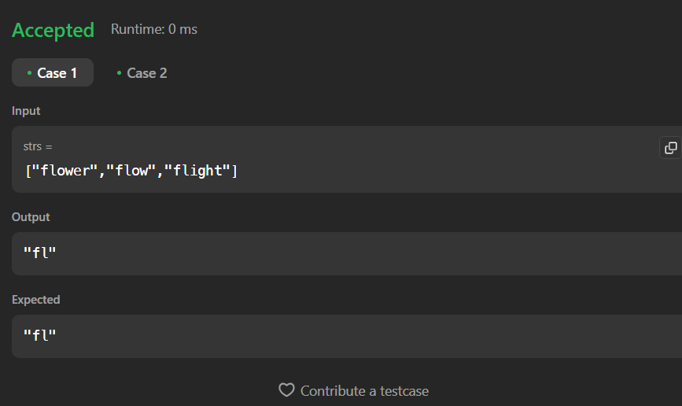

# Dremwar_CPD
Задание: Container Longest Common Prefix (Напишите функцию, которая найдет самую длинную строку с общим префиксом среди массива строк.

Если общего префикса нет, верните пустую строку "".)


# Описание программы Container Longest Common Prefix:
Данная прога принимает вектор из слов и выводит одинаковые части этих слов, если она их не находит, то выводит просто пусто.


# Листинг Container Longest Common Prefix:
```rs
Программа в leetcode
impl Solution {
    pub fn longest_common_prefix(strs: Vec<String>) -> String {
        if strs.is_empty() {
                return String::new();
            }
            
            let mut prefix = String::new();
            for i in 0..strs[0].len() {
                let char = strs[0].chars().nth(i).unwrap();
                for j in 1..strs.len() {
                    if i >= strs[j].len() || char != strs[j].chars().nth(i).unwrap() {
                        return prefix;
                    }
                }
                prefix.push(char);
            }
            prefix
    }
}
```

```rs
программа в visual studio
use std::io;
fn l_c_p(strs: Vec<String>) -> String {
    if strs.is_empty() {
        return String::new();
    }
    
    let mut prefix = String::new();
    for i in 0..strs[0].len() {
        let char = strs[0].chars().nth(i).unwrap();
        for j in 1..strs.len() {
            if i >= strs[j].len() || char != strs[j].chars().nth(i).unwrap() {
                return prefix;
            }
        }
        prefix.push(char);
    }
    
    prefix
}
fn main() {
    let mut input = String::new();

    io::stdin().read_line(&mut input)
        .expect("");

    let strings: Vec<String> = input.trim()
        .split(' ')
        .map(|x| x.parse().expect(""))
        .collect();
    
    let result = l_c_p(strings);
    println!("Longest common prefix: {}", result);
}
```

Скриншот1(Результат работы):




