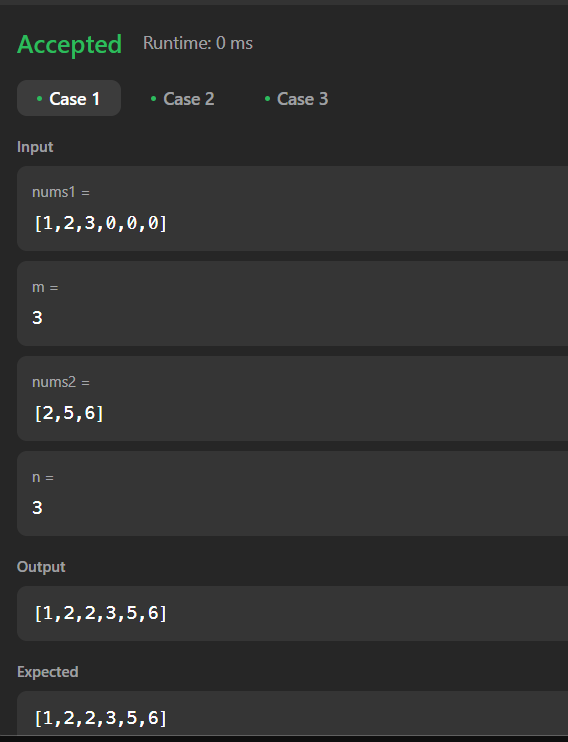

# Dremwar_CPD
Задание: Merge Sorted Array (Вам даны два целочисленных массива nums1 и nums2, отсортированных в порядке неубывания, и два целых числа m и n, представляющие количество элементов в nums1 и nums2 соответственно.

Объедините nums1 и nums2 в один массив, отсортированный в порядке убывания.

Конечный отсортированный массив не должен возвращаться функцией, а должен храниться внутри массива nums1. Чтобы учесть это, nums1 имеет длину m + n, где первые m элементов обозначают элементы, которые должны быть объединены, а последние n элементов имеют значение 0 и должны игнорироваться. nums2 имеет длину n.)


# Описание программы Merge Sorted Array:
Данная прога принимает два массива, обеденяет их и сортирует, а потом выводит.


# Листинг Merge Sorted Array:
```rs
Программа в leetcode
impl Solution {
    pub fn merge(nums1: &mut Vec<i32>, m: i32, nums2: &mut Vec<i32>, n: i32) {
        nums1.truncate(m as usize);
        nums2.truncate(n as usize);
        nums1.append(nums2);
        nums1.sort();
    }    
}
```

```rs
Программа в visual studio
use std::io;
use std::io::BufRead;
fn main() {

    let stdin = io::stdin();
    let input = stdin.lock().lines().next().unwrap().unwrap();
    let mut nums1: Vec<i32> = input
        .split_whitespace()
        .map(|x| x.parse().unwrap())
        .collect();

    let mut input1 = String::new();
    io::stdin().read_line(&mut input1)
        .expect("Не удалось прочитать строку");

    let m: usize = input1.trim().parse()
        .expect("Введено некорректное число");

    nums1.truncate(m);
    
    let stdin = io::stdin();
    let input = stdin.lock().lines().next().unwrap().unwrap();
    let mut nums2: Vec<i32> = input
        .split_whitespace()
        .map(|x| x.parse().unwrap())
        .collect();

    let mut input2 = String::new();
    io::stdin().read_line(&mut input2)
        .expect("Не удалось прочитать строку");

    let n: usize = input2.trim().parse()
        .expect("Введено некорректное число");

    nums2.truncate(n);

    nums1.append(&mut nums2);
    nums1.sort();
    println!("{:?}", nums1);
}
```

Скриншот1(Результат работы):




