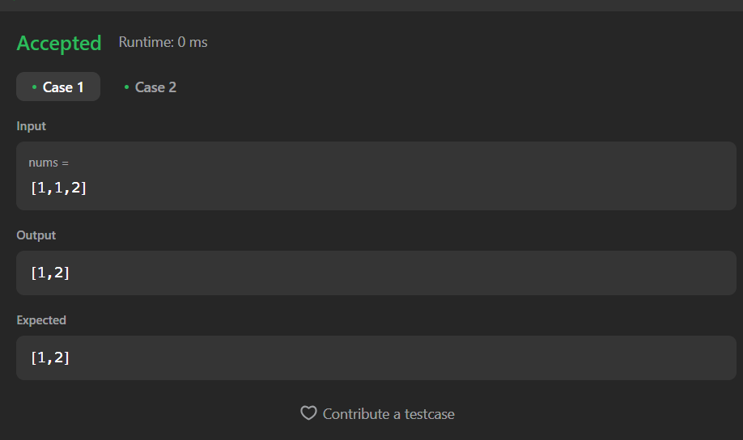

# Dremwar_CPD
Задание: Remove Duplicates from Sorted Array (При наличии целочисленного массива nums, отсортированного в порядке неубывания, удалите дубликаты на месте, чтобы каждый уникальный элемент отображался только один раз. Относительный порядок элементов должен оставаться неизменным. Затем верните количество уникальных элементов в nums.

Предположим, что количество уникальных элементов в nums равно k, для того, чтобы их приняли, вам нужно выполнить следующие действия:

Измените массив nums таким образом, чтобы первые k элементов в nums содержали уникальные элементы в том порядке, в котором они изначально присутствовали в nums. Остальные элементы nums не важны, так же как и размер nums.
Верните k.)

# Описание программы Remove Duplicates from Sorted Array:
Данная программа сортирует элементы в массиве и удаляет повторяющиеся, а потом выводит получившийся массив.

# Листинг Remove Duplicates from Sorted Array:
```rs
Программа в leetcode
impl Solution {
    pub fn remove_duplicates(nums: &mut Vec<i32>) -> usize {
        if nums.is_empty() {
            return 0;
        }
        
        let mut index = 0;
        
        for i in 1..nums.len() {
            if nums[i] != nums[index] {
                index += 1;
                nums[index] = nums[i];
            }
        }
        
        nums.truncate(index + 1);
        
        nums.len()
    }   
}
```

```rs
Программа в visual studio
use std::io;
use std::io::BufRead;
fn remove_duplicates(nums: &mut Vec<i32>) -> usize {
    if nums.is_empty() {
        return 0;
    }
    
    let mut index = 0;
    
    for i in 1..nums.len() {
        if nums[i] != nums[index] {
            index += 1;
            nums[index] = nums[i];
        }
    }
    
    nums.truncate(index + 1);
    
    nums.len()
}

fn main() {
    let stdin = io::stdin();
    let input = stdin.lock().lines().next().unwrap().unwrap();
    let mut nums: Vec<i32> = input
        .split_whitespace()
        .map(|x| x.parse().unwrap())
        .collect();

    let unique_count = remove_duplicates(&mut nums);
    
    println!("Unique count: {}", unique_count);
    println!("Unique elements: {:?}", nums);
}
```

Скриншот1(Результат работы):




