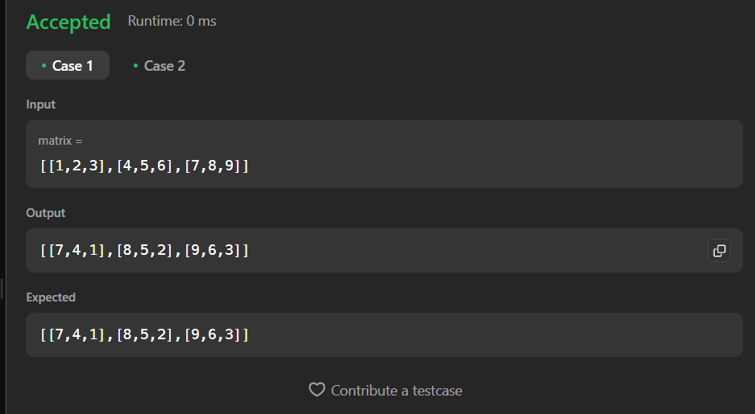

# Dremwar_CPD
Задание: Rotate Image (Вам дана n x n двумерных матриц, представляющих изображение, поверните изображение на 90 градусов (по часовой стрелке).

Вы должны повернуть изображение на месте, что означает, что вам необходимо изменить входную двумерную матрицу напрямую. НЕ выделяйте другую двумерную матрицу и не выполняйте поворот.)

# Описание программы Rotate Image:
Данная прога принимает массивы которые выстроены в матрицу, после этого она переворачивает матрицу на 90 градусов и выводи её.

# Листинг Rotate Image:
```rs
Программа в leetcode
impl Solution {
    pub fn rotate(matrix: &mut Vec<Vec<i32>>) {
        let n = matrix.len();

        for i in 0..n/2 {
            for j in i..n-i-1 {
                let temp = matrix[i][j];
                matrix[i][j] = matrix[n-j-1][i];
                matrix[n-j-1][i] = matrix[n-i-1][n-j-1];
                matrix[n-i-1][n-j-1] = matrix[j][n-i-1];
                matrix[j][n-i-1] = temp;
            }
        }
    }         
}
```

```rs
Программа в visual studio
fn rotate_image(matrix: &mut Vec<Vec<i32>>) {
    let n = matrix.len();

    for i in 0..n/2 {
        for j in i..n-i-1 {
            let temp = matrix[i][j];
            matrix[i][j] = matrix[n-j-1][i];
            matrix[n-j-1][i] = matrix[n-i-1][n-j-1];
            matrix[n-i-1][n-j-1] = matrix[j][n-i-1];
            matrix[j][n-i-1] = temp;
        }
    }
}

fn main() {
    let mut image = vec![vec![1,2,3], vec![4,5,6], vec![7,8,9]];
    
    println!("Original image:");
    for row in &image {
        println!("{:?}", row);
    }

    rotate_image(&mut image);

    println!("Rotated image:");
    for row in &image {
        println!("{:?}", row);
    }
}
```

Скриншот1(Результат работы):




