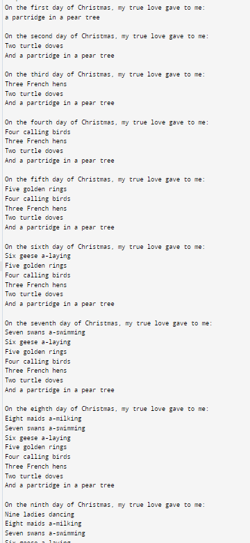

# Dremwar_CPD
Задание: 12 дней рождества (Распечатайте текст рождественской песни "Двенадцать дней Рождества", воспользовавшись повторами в песне.) 


# Описание программы 12 дней рождества:
Данная программа выводит в консоль английскую песню 12 дней рождества.


# Листинг 12 дней рождества:
```rs
fn main() {
    let days = ["first", "second", "third", "fourth", "fifth", "sixth", "seventh", "eighth", "ninth", "tenth", "eleventh", "twelfth"];
    let gifts = [
        "a partridge in a pear tree",
        "Two turtle doves",
        "Three French hens",
        "Four calling birds",
        "Five golden rings",
        "Six geese a-laying",
        "Seven swans a-swimming",
        "Eight maids a-milking",
        "Nine ladies dancing",
        "Ten lords a-leaping",
        "Eleven pipers piping",
        "Twelve drummers drumming",
    ];

    for i in 0..12 {
        println!("On the {} day of Christmas, my true love gave to me:", days[i]);
        for j in (0..=i).rev() {
            if j == 0 && i != 0 {
                println!("And {}", gifts[j]);
            } else {
                println!("{}", gifts[j]);
            }
        }
        println!();
    }
}
```

Скриншот1(Результат работы):




