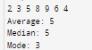

# Dremwar_CPD
Задание: Среднее, медиана,мода (Есть список целых чисел. Создайте функцию, используйте вектор и верните из списка: среднее значение; медиану (значение элемента из середины списка после его сортировки); моду списка (mode of list, то значение которое встречается в списке наибольшее количество раз; HashMap будет полезна в данном случае).)


# Описание программы Среднее, медиана,мода:
Данная программа принимает список целых чисел, и выводит среднее значение этого списка, медиану и его моду.


# Листинг Среднее, медиана,мода:
```rs
use std::collections::HashMap; //Импорт необходимых библиотек: HashMap, io и BufRead
use std::io;
use std::io::BufRead;

fn calculate_stats(numbers: Vec<i32>) -> (i32, i32, i32) {//Определение функции calculate_stats, которая принимает вектор  i32 и возвращает кортеж  i32.
    let mut sorted_numbers = numbers.clone();//Создание копии вектора и сортируем его (для подсчета медианы).
    sorted_numbers.sort();

    let mean = numbers.iter().sum::<i32>() / numbers.len() as i32;//Вычисление среднего значения
    
    let median = if numbers.len() % 2 == 0 { //Определение медианы
        let mid = numbers.len() / 2;
        (sorted_numbers[mid - 1] + sorted_numbers[mid]) / 2
    } else {
        sorted_numbers[numbers.len() / 2]
    };

    let mut freq_map = HashMap::new();//считаем моду
    for &num in &numbers {
        *freq_map.entry(num).or_insert(0) += 1;
    }

    let mut mode = 0;//выводим моду
    let mut max_freq = 0;
    for (&num, &freq) in &freq_map {
        if freq > max_freq {
            max_freq = freq;
            mode = num;
        }
    }

    (mean, median, mode)
}

fn main() { //создаём функцию которая будет принимать значения вводимые пользователем и отправлять их на обработку
    let stdin = io::stdin(); 
    let input = stdin.lock().lines().next().unwrap().unwrap();
    let numbers: Vec<i32> = input
        .split_whitespace()
        .map(|x| x.parse().unwrap())
        .collect();
    let (mean, median, mode) = calculate_stats(numbers);

    println!("Average: {}", mean);//Выводим результаты
    println!("Median: {}", median);
    println!("Mode: {}", mode);
}
```

Скриншот1(Результат работы):




