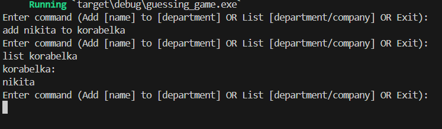

# Dremwar_CPD
Задание: Используя хеш-карту и векторы, создайте текстовый интерфейс позволяющий пользователю добавлять имена сотрудников к названию отдела компании. Например, "Add Sally to Engineering" или "Add Amir to Sales". Затем позвольте пользователю получить список всех людей из отдела или всех людей в компании, отсортированных по отделам в алфавитном порядке.


# Описание программы текстовый интерфейс:
Данная программа позволяет пользователю создавать список компаний и сотрудников этих компаний через команду add и простматривать эти списки через команду list


# Листинг текстовый интерфейс:
```rs
use std::collections::HashMap; //Импортируем структуру HashMap
use std::io; //Импортируем структуру io из модуля std

fn main() { //Импортируем структуру io из модуля std
    let mut company: HashMap<String, Vec<String>> = HashMap::new(); //Создаем пустой хэшмап company, который будет хранить отделы компании и сотрудников в каждом отделе

    loop { //Начинаем бесконечный цикл
        println!("Enter command (Add [name] to [department] OR List [department/company] OR Exit):"); //Выводим приглашение для ввода команды
        let mut input = String::new(); //Читаем строку от пользователя и обрезаем пробельные символы
        io::stdin().read_line(&mut input).expect("Failed to read line");
        let input = input.trim();

        if input.to_lowercase() == "exit" { //Проверяем введенную команду: если пользователь ввел "exit", то заканчиваем цикл
            break;
        }

        let parts: Vec<&str> = input.split_whitespace().collect(); //Разбиваем введенную строку на части по пробелам и кладем в вектор parts

        if parts.len() >= 4 && parts[0].to_lowercase() == "add" && parts[2].to_lowercase() == "to" {  //Проверяем команду: если введено "add [name] to [department]" и длина parts >= 4, то добавляем сотрудника в отдел
            let name = parts[1].to_string();
            let department = parts[3].to_string();
            let employees = company.entry(department.clone()).or_insert(Vec::new());
            employees.push(name);
            employees.sort();
        } else if parts.len() >= 2 && parts[0].to_lowercase() == "list" {//Если введена команда "list [department/company]" и parts.len() >= 2, то выводим список сотрудников в указанном отделе или компании
            if parts[1].to_lowercase() == "company" {
                for (department, employees) in company.iter() {
                    println!("{}:", department);
                    for employee in employees {
                        println!("{}", employee);
                    }
                }
            } else {
                let department = parts[1].to_string();
                match company.get(&department) {
                    Some(employees) => {
                        println!("{}:", department);
                        for employee in employees {
                            println!("{}", employee);
                        }
                    },
                    None => println!("Department not found"),//Если введенная команда не подходит, выводим сообщение об ошибке
                }
            }
        } else { //Если введенная команда не подходит, выводим сообщение об ошибке
            println!("Invalid command, please try again");
        }
    }
}
```

Скриншот1(Результат работы):




