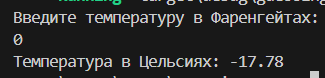

# Dremwar_CPD
Задание: перевод фарингейтов в цельсии (Программа должна принимать значение в фарингейтах и переводить в цельсии)


# Описание программы перевод фарингейтов в цельсии:
Программа на входе принимает значение фарингейтов и выводит его в цельсиях.


# Листинг перевод фарингейтов в цельсии:
```rs
use std::io;

fn main() {
    println!("Введите температуру в Фаренгейтах:");
    let mut fahrenheit = String::new();
    io::stdin().read_line(&mut fahrenheit)
        .expect("Ошибка при считывании данных");

    let fahrenheit: f64 = fahrenheit.trim().parse()
        .expect("Введите корректное значение");

    let celsius = (fahrenheit - 32.0) * 5.0/9.0;
    println!("Температура в Цельсиях: {:.2}", celsius);
}
```

Скриншот1(Результат работы):




