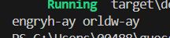

# Dremwar_CPD
Задание: Поросячая латынь (Преобразуйте строку в кодировку "поросячьей латыни" (Pig Latin). Первая согласная каждого слова перемещается в конец и к ней добавляется окончание "ay", так "first" станет "irst-fay". Слову, начинающемуся на гласную, в конец добавляется "hay" ("apple" становится "apple-hay")


# Описание программы поросячая латынь:
Данная программа берет каждое слово в строке и переносит его первую согластную в конец и добавляет приставку -ay.


# Листинг поросячая латынь:
```rs
fn pig_latin(s: &str) -> String { 
    let vowels = ['a', 'e', 'i', 'o', 'u'];
    let mut result = String::new();
    
    for word in s.split_whitespace() {
        let mut modified_word = String::new();
        let mut first_char = 'a';
        let mut consonants = String::new();
        let mut is_capitalized = false;
        
        for (i, c) in word.chars().enumerate() {
            if i == 0 {
                first_char = c;
                if c.is_uppercase() {
                    is_capitalized = true;
                    first_char = c.to_lowercase().next().unwrap();
                }
            } else if !vowels.contains(&c.to_lowercase().next().unwrap()) {
                consonants.push(c);
            } else {
                modified_word.push(c);
            }
        }
        
        if vowels.contains(&first_char) {
            if is_capitalized {
                modified_word.push_str(&word);
            } else {
                modified_word = word.to_string();
            }
            modified_word.push_str("-ay");
        } else {
            if is_capitalized {
                modified_word.push_str(&consonants);
                modified_word.push_str(&first_char.to_uppercase().to_string());
                modified_word.push_str(&word.chars().skip(1).collect::<String>());
            } else {
                modified_word.push_str(&consonants);
                modified_word.push(first_char);
            }
            modified_word.push_str("-ay");
        }
        
        result.push_str(&modified_word);
        result.push(' ');
    }
    
    result.trim().to_string()
}

fn main() {
    let sentence = "hello world";
    let pig_latin_sentence = pig_latin(sentence);
    println!("{}", pig_latin_sentence);
}
```

Скриншот1(Результат работы):




